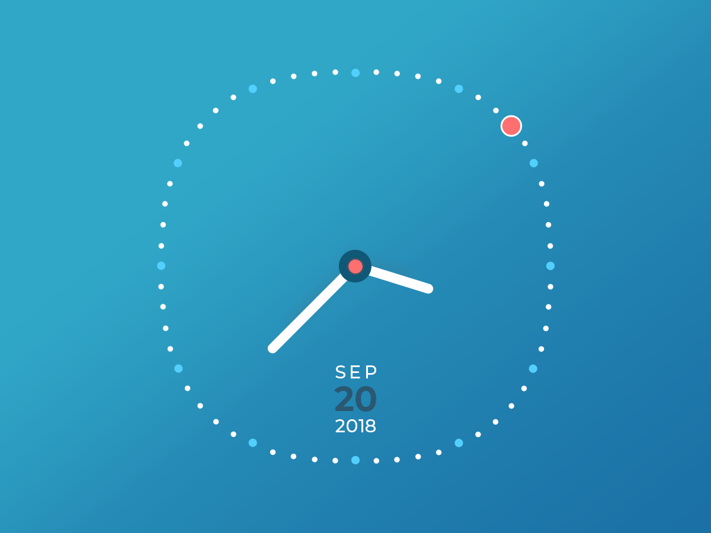

# MinimalistAnalogClock
* This an android analog clock widget designed by material design guides.
* This project is based on Afsal Rahiman Minimalist Clock UI concept. [See on Uplabs](https://www.uplabs.com/posts/minimalist-clock-ui) 
 
 
## How to use
* As a widget just install app and select widget from home screen, select preferences and click add widget button to add to home screen.
* As a view you can use Clock view as below

```
<rezaei.mohammad.neo.minimalistanalogclock.Clock
        android:id="@+id/clock"
        android:layout_width="250dp"
        android:layout_height="250dp"
        android:layout_centerHorizontal="true"
        app:hourDotColor="@color/light_blue"
        app:minuteDotColor="@color/white"
        app:handsColor="@color/white"
        app:secondDotColor="@color/red"
        app:showDate="true"
        app:showSecond="true"
        app:datePrimaryColor="@color/white"
        app:dateSecondaryColor="@color/black"
        app:centerCirclePrimaryColor="@color/blue_grey"
        app:centerCircleSecondaryColor="@color/red" />
```
All these attributes are accessable in code too.
